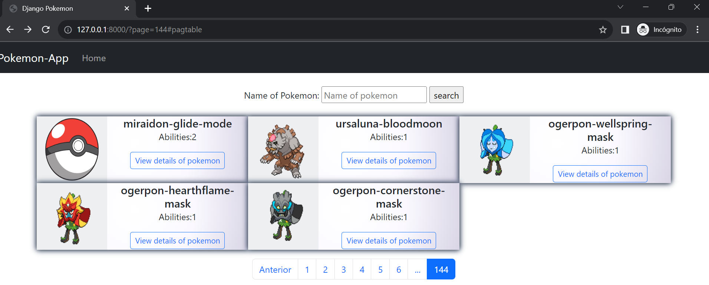
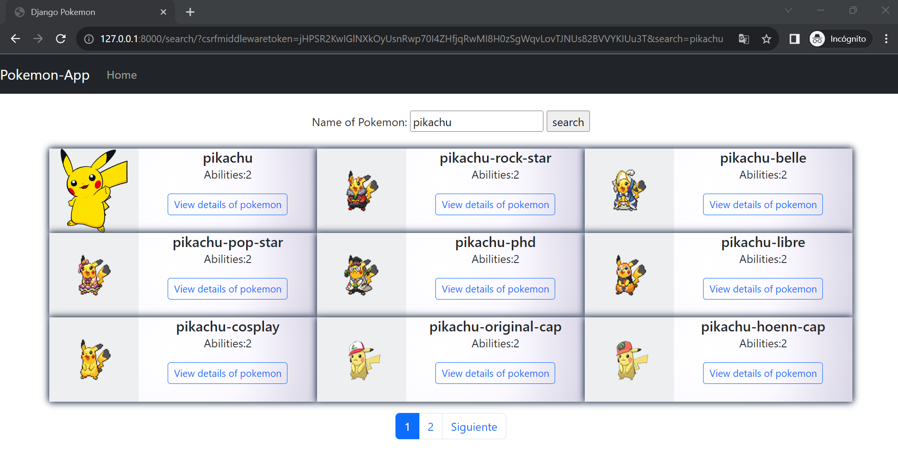
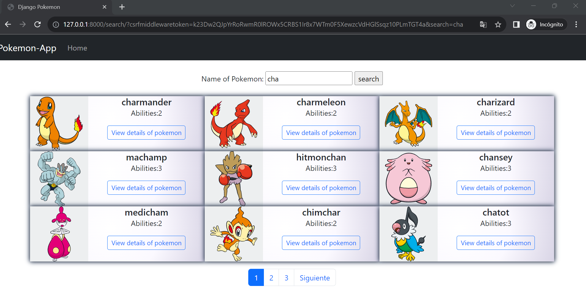
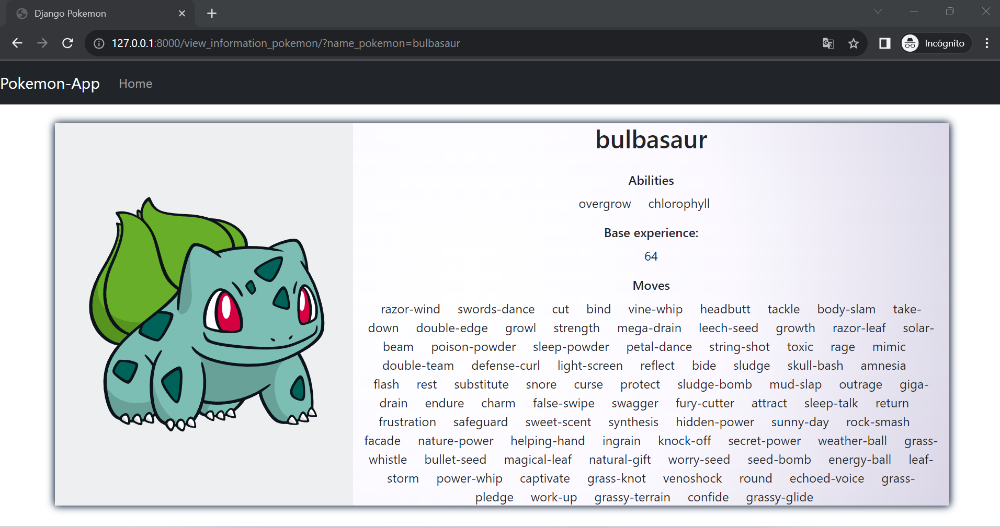

# PokemonApp

## Descripción
Este proyecto se centra en el desarrollo de una aplicación que utiliza Django para interactuar con una API de Pokémon, mostrando una lista de estos junto con su información. La aplicación también cuenta con un paginador y un buscador para facilitar la búsqueda y filtrado de información.

## Instrucciones de Instalación
1. Clona este repositorio: `git clone https://github.com/tu_usuario/tu_proyecto.git`
2. Navega al directorio del proyecto: `cd tu_proyecto`
3. Instala las dependencias: `pip install -r requirements.txt`

## Nota
Se recomienda la creación de un entorno virtual para el proyecto, utilizando herramientas como `virtualenv`. Los pasos para su configuración son los siguientes:
1. Instala la librería mediante el comando: `pip install virtualenv`
2. Ejecuta `virtualenv` con la instrucción: `virtualenv venv`
3. Activa el entorno virtual; en Windows: `.\venv\Scripts\activate`
4. Posteriormente, instala las dependencias del proyecto como se indicó en la sección anterior: `pip install -r requirements.txt`

## Ejecución de la Aplicación
Para iniciar la aplicación, ejecuta el comando: `python manage.py runserver`

# Revisión de la Aplicación
En este proyecto de Django, se creó una aplicación llamada "pokemonapp" donde se configuró la estructura de la misma.

## Archivo views.py
Ubicado en `./pokemonapp/views.py`, este archivo contiene las distintas vistas accesibles a través de la aplicación web de Django. Es necesario configurar el archivo de rutas ubicado en `./pokemonapp/urls.py` y el archivo de configuración de la aplicación principal en `./mysite/urls.py`.

El archivo views.py incluye rutas como:
1. **pokemons:** Permite obtener todos los Pokémon de la API, y mediante el uso de un paginador ir visualizando una cantidad específica de pokemons. Cabe recalcar que se implementó el uso de hilos para minimizar los tiempos de respuesta.
2. **search:** Permite buscar Pokémon según el nombre ingresado por el usuario.
3. **pokemon_information:** Permite visualizar información específica de un Pokémon.

# Vista previa de la aplicación
## Home

## Búsqueda de pokemons

## Ver la información del pokemon

